# HN AI Index Website Plan

## Architecture Overview

```mermaid
flowchart LR
  HN_API["HN Firebase API"] -->|"top 30 post IDs + titles"| GH_Action["GitHub Actions (cron)"]
  GH_Action -->|"keyword classify"| Classifier["classifier.ts"]
  Classifier -->|"append snapshot"| DataFile["data/snapshots.json"]
  DataFile -->|"git commit + push"| Repo["GitHub Repo"]
  Repo -->|"trigger deploy workflow"| Build["vite build"]
  Build -->|"deploy dist/"| GHPages["GitHub Pages"]
  GHPages --> Site["Public website"]
```



## Stack

- **Vite + React + TypeScript** — minimal setup, fast builds, outputs a plain `dist/` folder
- **Recharts** — lightweight React chart library for the time-series graphs
- **Tailwind CSS** — minimal styling effort
- **GitHub Actions** — cron scheduler (every 6 hours) + deploy workflow
- **GitHub Pages** — hosts the static output, free, no extra account needed

## Data Shape

`data/snapshots.json` — array of snapshots, each appended by the cron:

```json
[
  {
    "ts": "2026-09-19T18:00:00Z",
    "topN": 30,
    "aiCount": 12,
    "aiIndex": 0.40,
    "posts": [
      { "id": 12345, "title": "GPT-5 is out", "ai": true },
      ...
    ]
  }
]
```

## Classifier

`scripts/classifier.ts` — pure keyword list to start. Easy to extend with LLM later.

Key terms to match (case-insensitive, partial word):
`ai, llm, gpt, claude, gemini, openai, anthropic, agent, copilot, cursor, mistral, llama, diffusion, transformer, neural, rag, chatbot, embedding, langchain, agentic`

## File Structure

```
hn-ai-index/
├── data/
│   └── snapshots.json          # committed, append-only history
├── scripts/
│   ├── fetch-and-classify.ts   # fetches HN top N, classifies, appends snapshot
│   └── classifier.ts           # keyword matching logic
├── src/
│   ├── App.tsx                  # main page with charts
│   ├── main.tsx
│   └── index.css
├── index.html
├── .github/
│   └── workflows/
│       ├── fetch.yml            # cron job every 6h
│       └── deploy.yml           # build + deploy to GitHub Pages
├── vite.config.ts
└── package.json
```

## GitHub Actions Workflows

**`fetch.yml`** (data cron):

- Trigger: `schedule: cron '0 */6 * * *'` + `workflow_dispatch`
- Steps: checkout → install → `npx tsx scripts/fetch-and-classify.ts` → commit + push `data/snapshots.json`
- The push triggers `deploy.yml` automatically

**`deploy.yml`** (static site):

- Trigger: push to `main`
- Steps: checkout → install → `vite build` → `actions/upload-pages-artifact` → `actions/deploy-pages`
- Requires GitHub Pages source set to "GitHub Actions" in repo settings

## Website Pages

Single page (`/`) with:

1. **Hero stat** — current AI index percentage (latest snapshot)
2. **Line chart** — AI index % over time (all snapshots)
3. **Bar chart** — raw AI post count vs total posts per snapshot
4. **Latest posts list** — current snapshot's classified posts with AI badge

## Key Implementation Details

- HN API: `https://hacker-news.firebaseio.com/v1/topstories.json` for IDs, then `https://hacker-news.firebaseio.com/v1/item/{id}.json` for titles (fetch top 30 in parallel)
- `topN: 30` is a good default (configurable constant)
- Vite reads `snapshots.json` at build time via `import data from '../data/snapshots.json'`
- Set `base` in `vite.config.ts` to the repo name (e.g. `/hn-ai-index/`) for correct asset paths on GitHub Pages
- No server needed at runtime — pure static HTML/JS
