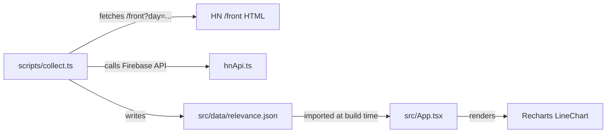

# HN AI Relevance MVP

## Architecture



## Data Flow

1. `scripts/collect.ts` loops over the last 14 days (yesterday back 2 weeks)
2. For each day: fetches `https://news.ycombinator.com/front?day=YYYY-MM-DD`, parses HTML with `htmlparser2` + `css-select` + `domhandler` to extract the top 30 post IDs only
3. For each ID: fetches full post data (title, domain, text) via `fetchPost()` from `hnApi.ts`
4. For each post: fetches top 5 comments via `fetchCommentText()` and bottom 5 via `fetchBottomCommentIds()` + `fetchCommentText()`, then calls Ollama REST API (`http://localhost:11434/api/generate`) with `qwen2.5:7b`, passing title + post text + top comments + bottom comments, to score relevance 0.0–1.0
5. Writes `src/data/relevance.json` — array of `{ date, posts: [{ id, title, domain, relevance }] }`
6. React app imports the JSON and renders a Recharts `LineChart` over time

## Files to Create/Change

- **`scripts/eval/LlmClassifier.ts`** (new) — implements the `Classifier` interface from `classifier.ts`, calls `http://localhost:11434/api/generate` with `qwen2.5:7b`
  - Prompt focuses on _subject matter_ relevance only: "Does the subject matter of this post relate to AI/ML? Ignore the tone of the discussion."
  - Registered in `runEval.ts` alongside `KeywordClassifier` so MAE/RMSE can be compared directly against labeled test cases
  - Iterated until relevance MAE beats or matches `KeywordClassifier` on `testCases.json`

- **`scripts/collect.ts`** (new) — the scraper/classifier pipeline
  - Fetches `/front?day=YYYY-MM-DD` HTML, parses with `htmlparser2` + `css-select` to extract post IDs from `item?id=XXXXXX` hrefs — nothing else
  - Fetches full post data for each ID via `fetchPost()` from `scripts/eval/hnApi.ts`
  - Fetches top 5 + bottom 5 comments using existing `fetchCommentText()` and `fetchBottomCommentIds()` from `hnApi.ts`
  - Calls Ollama `qwen2.5:7b` via `http://localhost:11434/api/generate` with title + post text + top comments + bottom comments, asking for a single relevance score 0.0–1.0
  - Parses the first float found in the response
  - Outputs to `src/data/relevance.json`

- **`src/data/relevance.json`** (new, generated) — the data file imported by React

- **`src/App.tsx`** (replace boilerplate) — renders the chart
  - Import `relevance.json`
  - `LineChart` with date on X axis and per-day relevance on Y axis (display logic TBD)
  - Simple tooltip showing post titles for that day

- **`package.json`** — add `recharts`, `htmlparser2`, `css-select`, `domhandler` dependencies (no Ollama SDK needed — plain `fetch` to the local REST API)

## Key Implementation Details

- **Ollama setup (one-time):** `brew install ollama && ollama pull qwen2.5:7b`, then `ollama serve`
- **Ollama prompt:** send title + post text + top 5 comments + bottom 5 comments to `qwen2.5:7b`, ask it to respond with a single number 0.0–1.0 representing AI relevance. Parse the first float found in the response. Context window is 32k — well within limits even for the longest posts.
- **Estimated runtime:** ~15–20 minutes for the full 14-day backfill (420 posts × ~1,500 tokens at ~60 tok/s on Mac Studio)
- HN `/front` HTML parsing: extract only post IDs from `item?id=XXXXXX` hrefs using `css-select` — title/domain/text come from the Firebase API via `fetchPost()`
- Output shape per post: `{ id, title, domain, relevance }` — no aggregation, raw scores only
- Date range: yesterday back 14 days, i.e. 14 data points total

## Run Command

```
node_modules/.bin/tsx scripts/collect.ts
```

Then `npm run dev` to view the chart.
